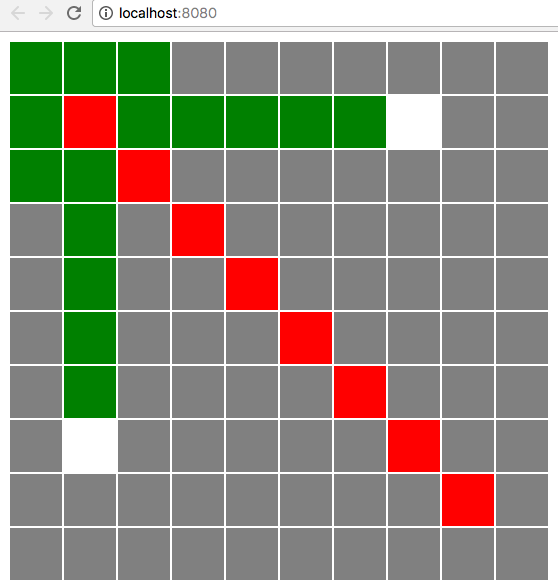

# Shortest Path using BFS

Given an unweighted map data like following:

```php
<?php 

$mapData = [
    [0,0,0,0,0,0,0,0,0,0],
    [0,1,0,0,0,0,0,2,0,0],
    [0,0,1,0,0,0,0,0,0,0],
    [0,0,0,1,0,0,0,0,0,0],
    [0,0,0,0,1,0,0,0,0,0],
    [0,0,0,0,0,1,0,0,0,0],
    [0,0,0,0,0,0,1,0,0,0],
    [0,3,0,0,0,0,0,1,0,0],
    [0,0,0,0,0,0,0,0,1,0],
    [0,0,0,0,0,0,0,0,0,0]
];

// 0 means road
// 1 means wall
// 2 means start
// 3 means end
```

Find the shortest path between start and end.

## Solution: BFS

Because the edge is unweighted, it's fast enough (`O(E+V)`)to use BFS.

## Setup

1. `php -S localhost:8080`
2. Visit [http://localhost:8080](http://localhost:8080)

## Screenshot


